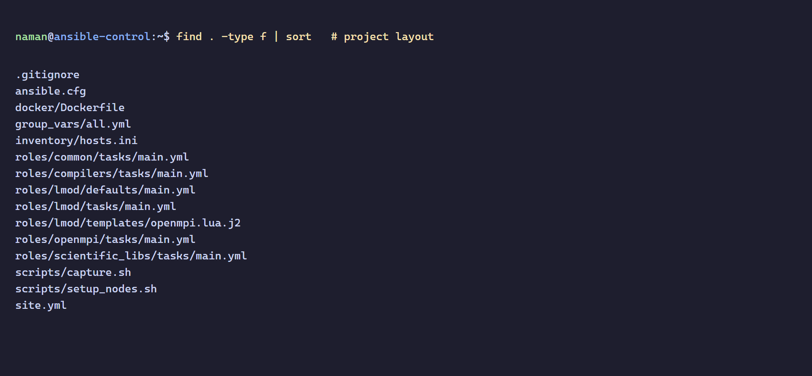
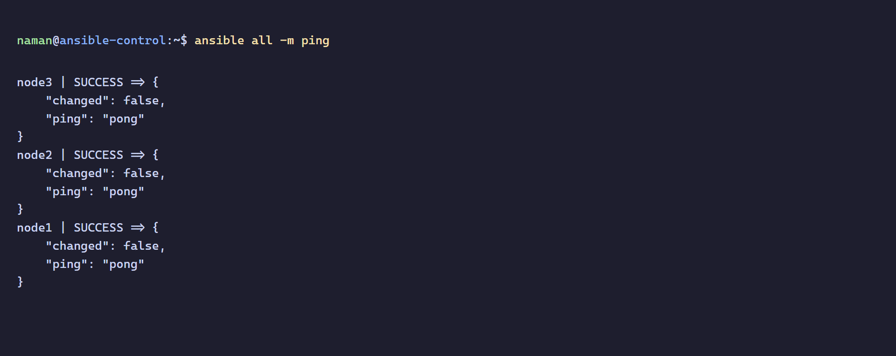
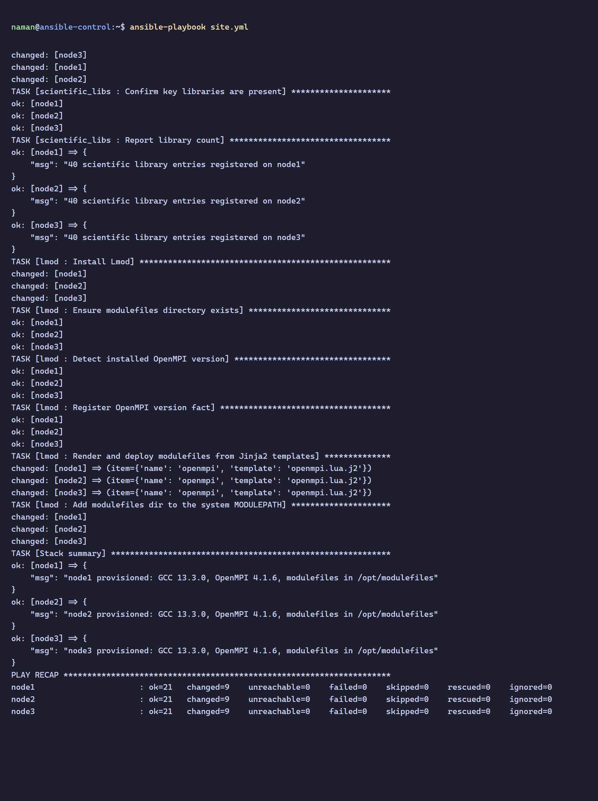
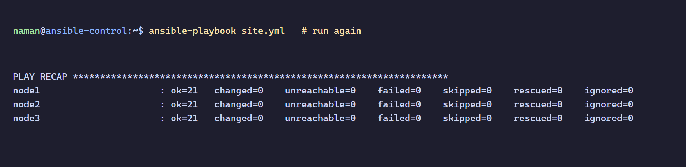
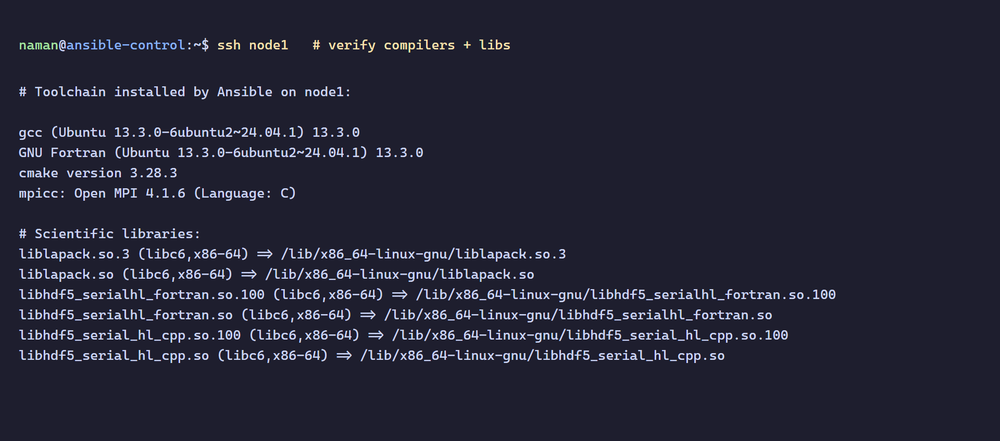
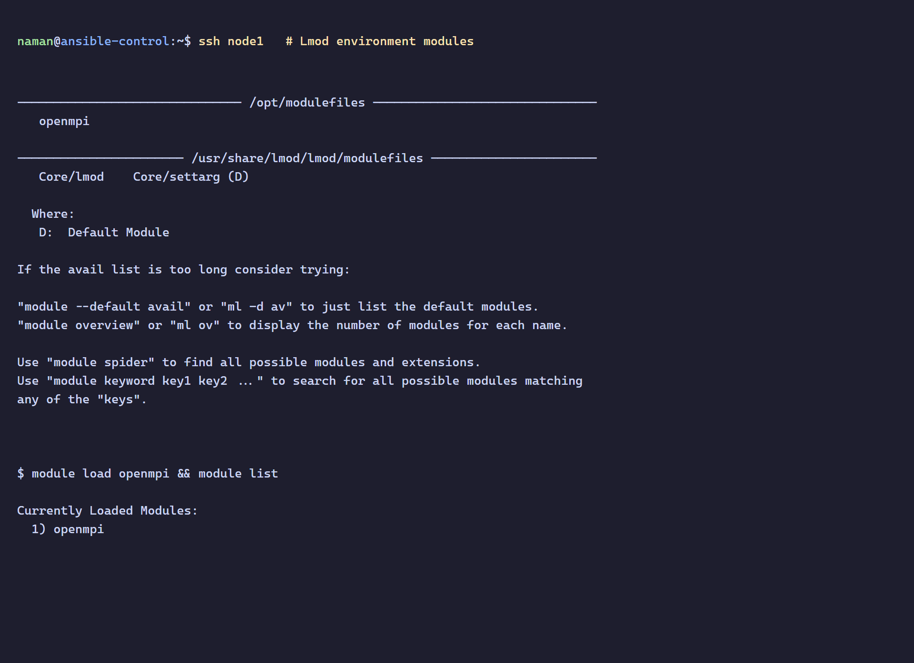
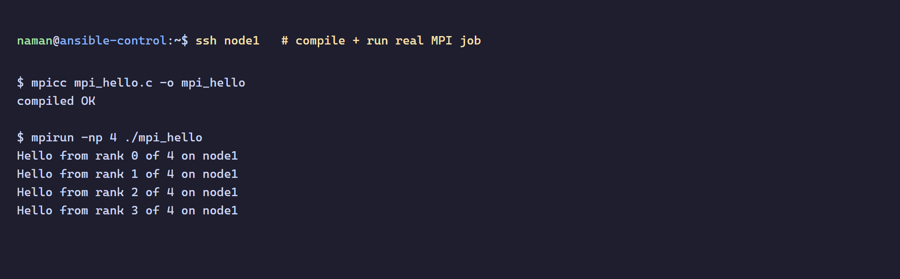
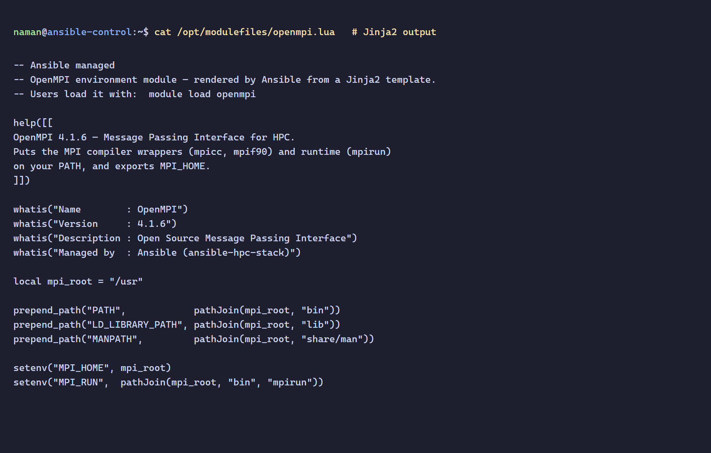

# ansible-hpc-stack

[](https://youtu.be/m_AZQ0V4rck)

Automated provisioning of a complete HPC software stack across compute nodes with **Ansible** - turning bare machines into job-ready HPC nodes, identically and repeatably.

A fresh node has nothing. This project installs everything a compute node needs to run jobs - compilers, OpenMPI, scientific libraries, and the Lmod environment-modules system - on **every node at once**, from a single source of truth. Run it twice and the second run changes nothing (idempotent), which is the whole point of configuration management: every node in the cluster stays provably identical.

## What gets provisioned

| Layer | Role | What it installs |
|---|---|---|
| Base | `common` | apt cache, base utilities, locale, shared apps dir |
| Compilers | `compilers` | GCC, G++, **gfortran**, CMake, autotools |
| MPI | `openmpi` | **OpenMPI** runtime + compiler wrappers (`mpicc`, `mpif90`, `mpirun`) |
| Libraries | `scientific_libs` | BLAS, LAPACK, FFTW, HDF5, ScaLAPACK |
| Modules | `lmod` | **Lmod** + a Jinja2-templated `openmpi` modulefile |

## Architecture

The three compute nodes are Docker containers (bare Ubuntu 24.04 + SSH + Python - nothing else). Ansible connects over SSH and installs the entire stack. This is the standard way to develop and test Ansible against a multi-node "cluster" before running it on real hardware; **the playbook is identical whether the targets are containers or 1,000 bare-metal nodes** - only the inventory changes.

## Repository structure

```
ansible-hpc-stack/
├── ansible.cfg                 # inventory path, SSH settings, YAML output
├── site.yml                    # master playbook (runs all roles)
├── inventory/
│   └── hosts.ini               # the 3 compute nodes
├── group_vars/
│   └── all.yml                 # single source of truth: package lists, versions
├── roles/
│   ├── common/                 # base setup
│   ├── compilers/              # GCC, gfortran, CMake
│   ├── openmpi/                # OpenMPI
│   ├── scientific_libs/        # BLAS, LAPACK, FFTW, HDF5
│   └── lmod/
│       ├── tasks/main.yml      # install Lmod, deploy modulefiles, set MODULEPATH
│       └── templates/
│           └── openmpi.lua.j2  # Jinja2 → /opt/modulefiles/openmpi.lua
├── docker/
│   └── Dockerfile              # bare compute-node image (SSH + Python only)
└── scripts/
    ├── setup_nodes.sh          # build image + start 3 node containers
    └── capture.sh              # screenshot helper
```

## Quick start

```bash
# 1. Spin up three bare "compute nodes" (Docker containers)
bash scripts/setup_nodes.sh

# 2. Confirm Ansible can reach all of them
ansible all -m ping

# 3. Provision the entire HPC stack on every node
ansible-playbook site.yml

# 4. Run it again - nothing changes (idempotent)
ansible-playbook site.yml
```

## Procedure

All screenshots below were captured on a real run on this machine.

### 1. Project layout
The Ansible role structure - each layer of the stack is its own reusable role.



### 2. Connectivity - `ansible all -m ping`
Ansible reaches all three compute nodes over SSH.



### 3. Provisioning - `ansible-playbook site.yml`
Every role runs across all three nodes; `changed=9` per node means the stack was installed.



### 4. Idempotency - running it again
The second run reports `changed=0` on every node. Nothing is reinstalled - the desired state is already met. This is the core guarantee of configuration management.



### 5. Toolchain verification
GCC, gfortran, CMake, OpenMPI, and the scientific libraries, all installed by Ansible.



### 6. Lmod environment modules
The Jinja2-templated `openmpi` modulefile appears under `module avail` and loads cleanly with `module load openmpi`.



### 7. Real MPI job - compile + run
Proof the stack actually works: an MPI program compiled with `mpicc` and run across 4 ranks with `mpirun`.



### 8. The rendered modulefile
The `openmpi.lua` modulefile on the node - generated by Ansible from the Jinja2 template, with the detected OpenMPI version filled in.



## Key Ansible concepts demonstrated

| Concept | Where |
|---|---|
| **Roles** (reusable, layered structure) | `roles/` |
| **Inventory** (defining the managed cluster) | `inventory/hosts.ini` |
| **Variables / single source of truth** | `group_vars/all.yml` |
| **Jinja2 templates** | `roles/lmod/templates/openmpi.lua.j2` |
| **Idempotency** | second `ansible-playbook` run → `changed=0` |
| **Handlers / facts / loops** | across the roles |
| **Privilege escalation** (`become`) | `site.yml` |

## Scaling to a real cluster

To provision actual hardware instead of containers, only the inventory changes:

```ini
[compute_nodes]
compute[01:64] ansible_host=10.0.1.[1:64]
```

The roles, templates, and playbook stay exactly the same - that's the power of infrastructure as code.
